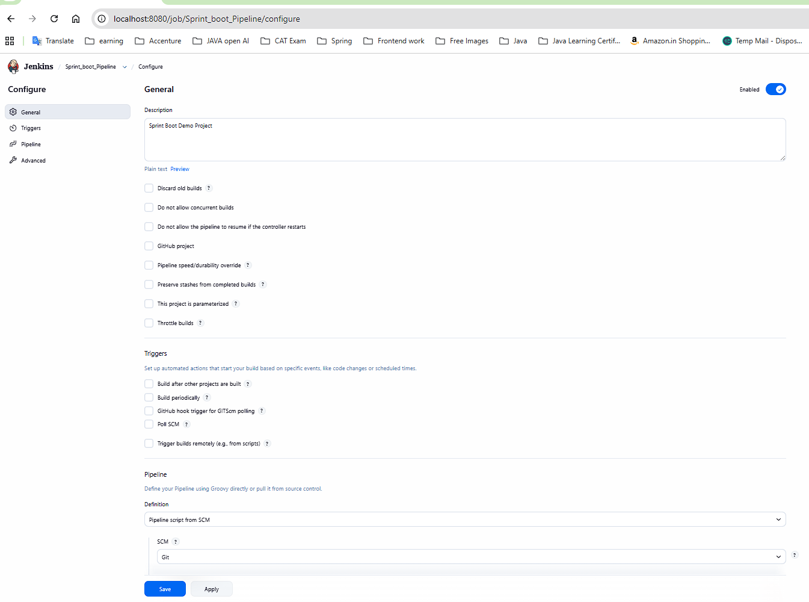
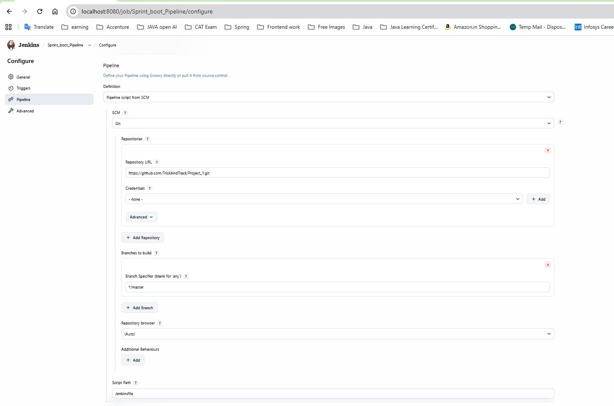
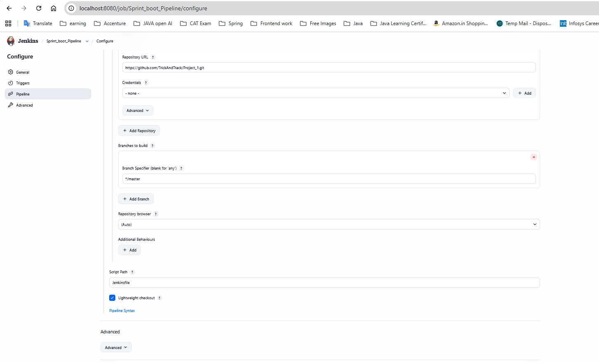

# How to create pipeline
a. install jenkins (for local only)

b. do setup or creat server local

c. run the jenkins install defult plugins

d. Navigate to your Jenkins installation folder (default is usually C:\Program Files\Jenkins)

e. if server stop and comming back run this command from jenkins install location
java -jar jenkins.war or java -jar jenkins.war --httpPort=8081

f. run on browser http://localhost:8080/job
# how to config piepline
## step 1

## setp2 

